# Objetos e tipos de dados do PostgreSQL

### O arquivo postgresql.conf

**Definição**

Arquivo onde estão definidas e armazenadas todas as configurações do servidor PostgreSQL. Alguns parâmetros só podem ser alterados com uma reinicialização do banco de dados. A view pg_settings, acessada por dentro do banco de dados, guarda todas as configurações atuais.

**postgresql.conf**

Ao acessar a view pg_settings, é possível visualizar todas as configurações atuais:

````sql
SELECT name, setting
FROM pg_settings;
````

Ou é possível usar o comando:

````sql
SHOW [parâmetro];
````

**Localização do arquivo postgresql.conf**

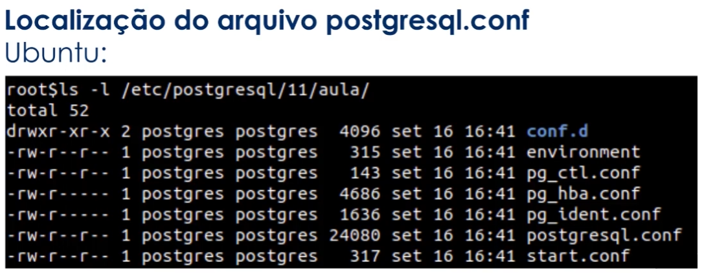

Por padrão, encontra-se dentro do diretório PGDATA definido no momento da inicialização do cluster de banco de dados.

No sistema operacional Ubuntu, se o PostgreSQL foi instalado a partir do repositório oficial, o local do arquivo postgresql.conf será diferente do diretório de dados.

````bash
/etc/postgressql/[versão]/[nome do cluster]/postgresql.conf
````

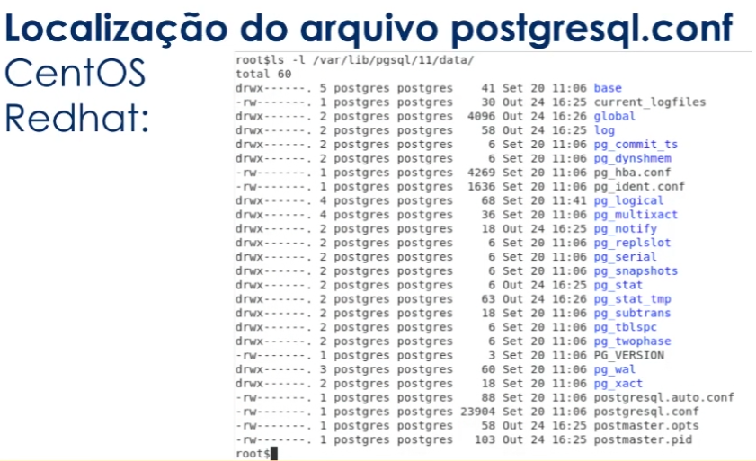

**Configurações de conexão**

- **LISTEN_ADDRESSES** - Endereço(s) TCP/IP das interfaces que o servidor PostgreSQL vai escutar/liberar conexões.
- **PORT** - A porta TCP que o servidor PostgreSQL vai ouvir. O padrão é 5432.
- **MAX_CONNECTIONS** - Número máximo de conexões simultâneas no servidor PostgreSQL.
- **SUPERUSER_RESERVED_CONNECTIONS** - Número de conexões (slots) reservados para conexões ao banco de dados de super usuários.
- **AUTRENTICATION_TIMEOUT** - Tempo máximo em segundos para o cliente conseguir uma conexão com o servidor.
- **PASSWORD_ENCRYPTION** - Algoritmo de criptografia das senhas dos novos usuários criados no banco de dados.
- **SSL** - Habilita a conexão criptografada por SSL (Somente se o PostgreSQL foi compilado com suporte SSL).

**Configuração de memória**

- **SHARED_BUFFERS** - Tamanho da memória compartilhada do servidor PostgreSQL para cache/buffer de tabelas, índices e demais relações.
- **WORK_MEM** - Tamanho da memória para operações de agrupamento e ordenação (ORDER BY, DISTINCT, MERGE JOINS).
- **MAINTENANCE_QORK_MEM** - Tamanho da memória para operações como VACUUM, INDEX, ALTER, TABLE.

### O arquivo pg_hba.conf

**Definição**

Arquivo responsável pelo controle de autenticação dos usuários no servidor PostgreSQL.

O formato do arquivo pode ser:

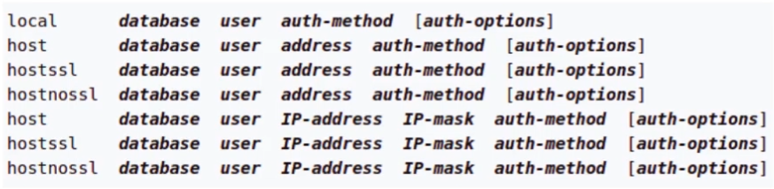

**Métodos de autenticação**

- **TRUST** - (conexão sem requisição de senha)
- **REJECT** - (rejeitar conexões)
- **MD5** - (criptografia md5)
- **PASSWORD** - (Senha sem criptografia)
- **GSS** - (Generic Security Service Application Program Interface)
- **SSPI** - (Security Support Provider Interface - somente para windows)
- **KRB5** - (Kerberos V5)
- **IDENT** - (Utiliza o usuário do sistema operacional do cliente via ident server)
- **PEER** - (Utiliza o usuário do sistema operacional do cliente)
- **LDAP** - (ldap server)
- **RADIUS** - (radius server)
- **CERT** - (Autenticação via certificado ssl do cliente)
- **PAM** - (pluggable authentication modules. O usuário precisa estar no banco de dados)

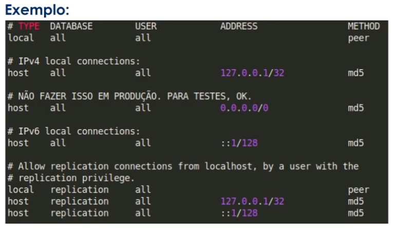

### O arquivo pg_ident.conf

**Definição**

Arquivo responsável por mapear os usuários do sistema operacional com os usuários do banco de dados. Localizado no diretório de dados PGDATA de sua instalação. A opção ident deve ser utilizada no arquivo pg_hba.conf.

 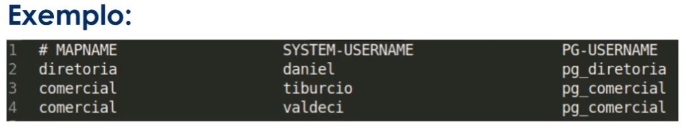

### Comandos administrativos

**Ubuntu:**

````bash
# Listar todos os cluster PostgreSQL
pg_lscluster
# Criar um novo cluster PostgreSQL
pg_createcluster <version> <cluster name>
# Apagar um cluster PostgreSQL
pg_dropcluster <version> <cluster>
# Start, Stop, Status, Restart de clusters PostgreSQL
pg_ctlcluster <version> <cluster> <action>
````

**CentOS:**

````bash
systemctl <action> <cluster>

# Iniciar o cluster PostgreSQL
systemctl start postgresql-13
# Mostra o status do cluster PostgreSQL
systemctl status postgresql-13
# Para o cluster PostgreSQL
systemctl stop postgresql-13
# Restarta o cluster PostgreSQL
systemctl restart postgresql-13
````

**Binários do  PostgreSQL:**

- createdb
- createuser
- dropdb
- dropuser
- initdb
- pg_ctl
- pg_basebackup
- pg_dump / pg_dumpall (Não é backup)
- pg_restore
- psql
- reindexdb
- vacuumdb

### Arquitetura/Hierarquia

**Cluster**

Coleção de bancos de dados que compartilham as mesmas configurações (arquivos de configuração) do PostgreSQL e do sistemas operacional (porta, listen_addresses, etc).

**Banco de dados (database)**

Conjunto de schemas com seus objetos/relações (tabelas, funções, views, etc).

**Schema**

Conjunto de objetos/relações (tabelas, funções, views, etc).

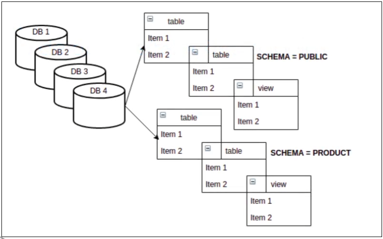

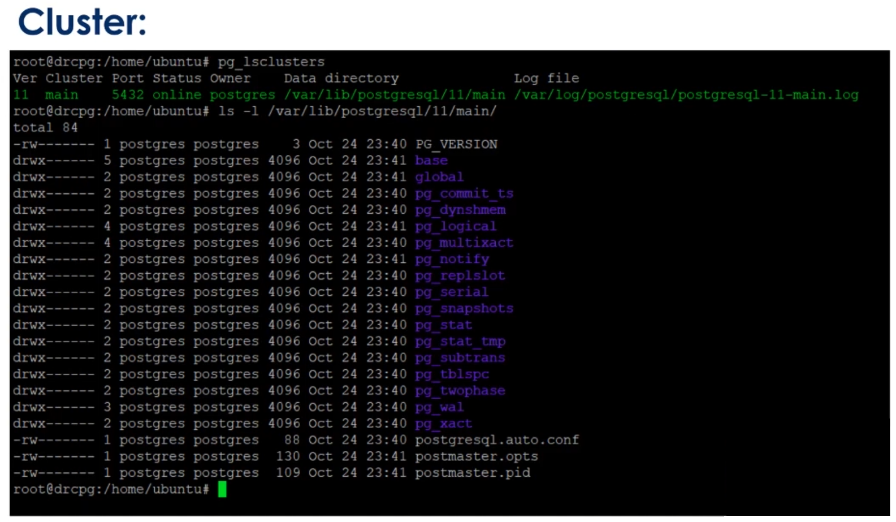

### Conhecendo a ferramenta PGAdmin

**Importante para conexão:**

1. Liberar acesso ao cluster em postgresql.conf.
2. Liberar acesso ao cluster para p usuário do banco de dados em pg_hba.conf.
3. Criar/editar usuários.

**Para liberar acesso:**

Editar o postgresql.conf


Ao iniciar a edição, desce ate "CONNECTIONS AND AUTHENTICATION", como mostra a imagem:

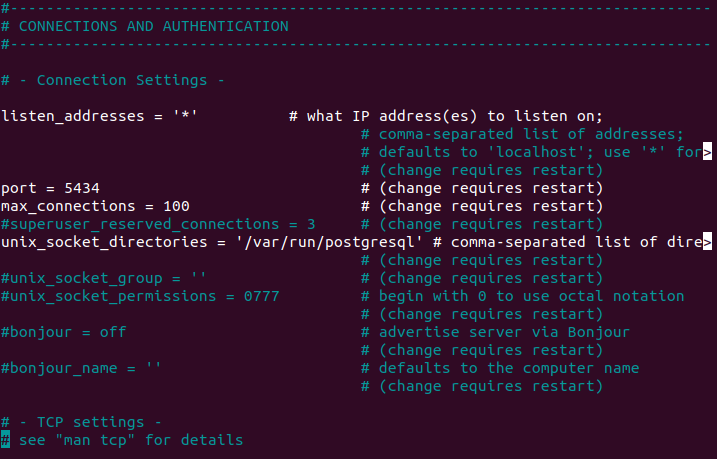

Alterar o listen_addresses para os IP's que poderão se conectar, "*****" significa que todos tem acesso, sendo recomendado usa-lo apenas em testes.

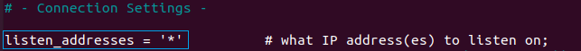

Por fim, iniciar o cluster com "pg_ctlcluster \<version> \<cluster name> start:


Para alterar a senha do usuário postgres, basta acessar o usuário com "sudo su - postgres" e depois o psql, seguindo a imagem:

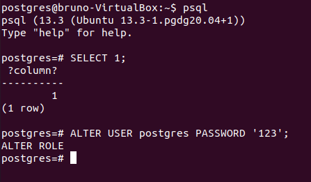

Após isso deve editar o arquivo pg_hba.conf:

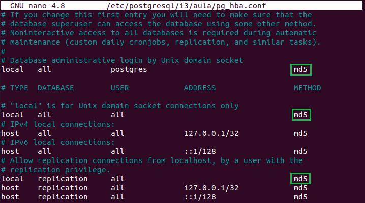

Por padrão, o que está em verde estará escrito "peer", isso significa que para acessar o banco, ele casara o usuário da maquina com o do banco para acessar,  já o "md5" irá pedir uma senha para acessar.

**PgAdmin4**

Primeiro passo é criar um grupo para os servidores:

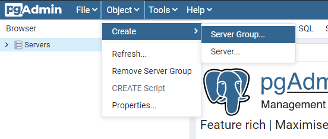

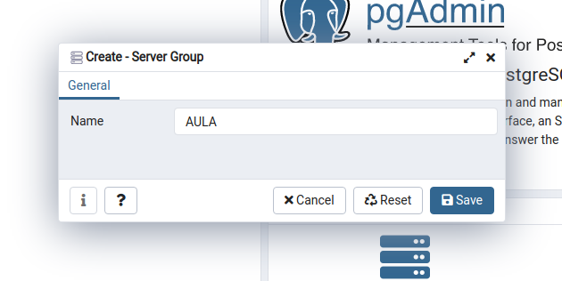

Criar um server:

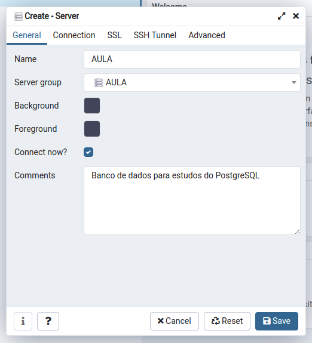

Obs: Comentar a finalidade do servidor é uma pratica recomendada.

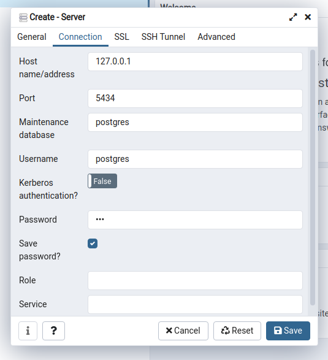

Agora com o grupo e o servidor criado, vamos criar o Banco de dados:

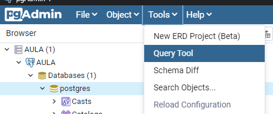

Utilizando Query Tool, vamos executar os seguintes comandos:

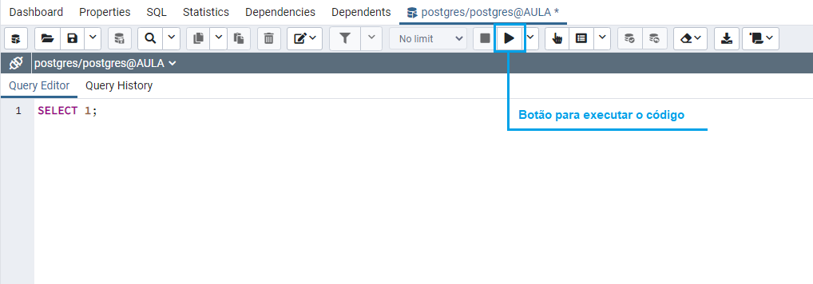

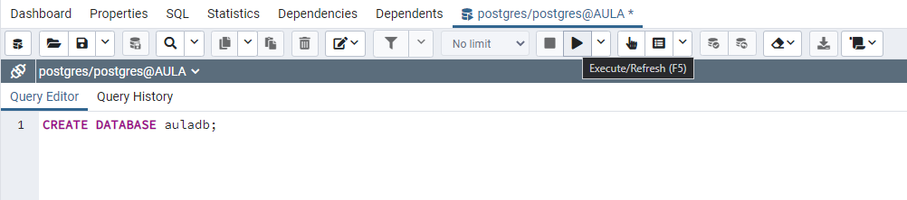

Após ser criado o novo banco de dados não aparecera na lista, sendo necessário um refresh:

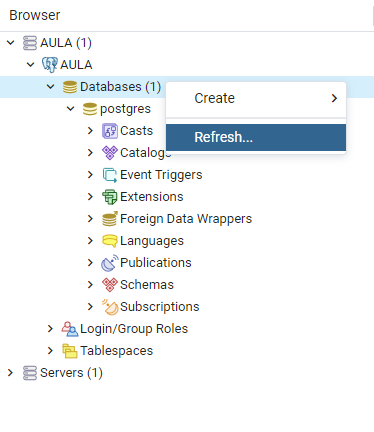

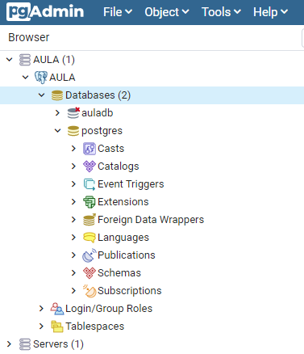

## Administração de usuários

### Conceitos  user/roles/groups

Roles (papéis ou funções), users (usuários) e grupo de usuários são "contas", perfis de atuação em um banco de dados, que possuem permissões em comum ou específicas.

Nas versões anteriores do PostgreSQL 8.1, usuários e roles tinham comportamentos diferentes.

Atualmente, roles e user são alias.

É possível que roles pertençam a outras roles;

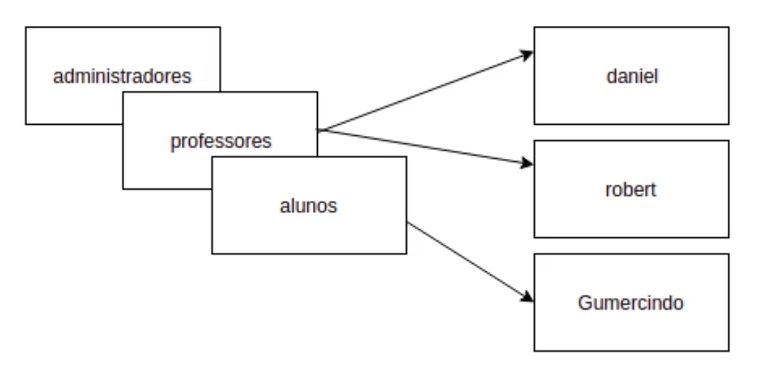

### Administrando user/roles/groups

CREATE ROLE name [WITH] option[...]

Onde option pode ser:

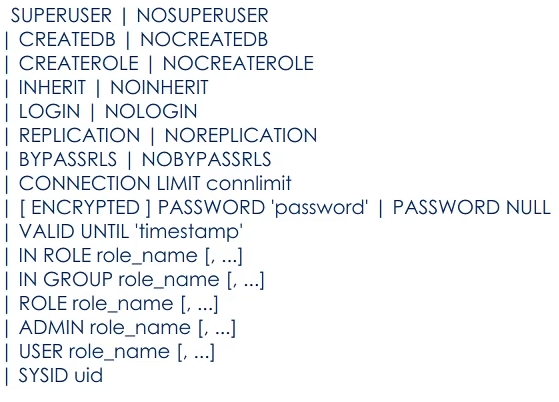

Exemplo:

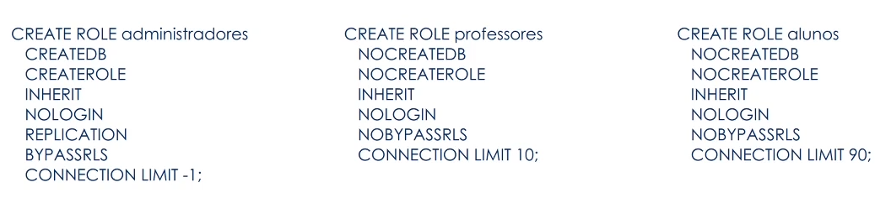

### Associação entre roles

Quando uma role assume as permissões de outra role. Necessário a opção INHERIT.

No momento de criação da role:

- IN ROLE (passa a pertencer a role informada)
- ROLE (a role informada passa a pertencer a nova role)

Ou após a criação da role:

````sql
GRANT [role a ser concedida] TO [role a assumir as permissões]
````

Exemplo:

`````sql
CREATE ROLE professores
	NOCREATEDB
	NOCRATEROLE
	INHERIT
	NOLOGIN
	NOBYPASSRLS
	CONNECTION LIMIT -1;
`````

````SQL
CREATE ROLE daniel LOGIN CONNECTION LIMIT 1 PASSWORD '123' IN ROLE professores;
````

- A role daniel passa a assumir as permissões da role professores

````sql
CREATE ROLE daniel LOGIN CONNECTION LIMIT 1 PASSWORD '123' ROLE professores;
````

- A role professores passar a fazer parte da role daniel assumindo suas permissões.

````plsql
CREATE ROLE daniel LOGIN CONNECTION LIMIT 1 PASSWORD '123';
GRANT professores TO daniel;
````

### Desassociar membros entre roles

REVOKE [role que será revogada] FROM [role que terá suas permissões revogadas]

````plsql
REVOKE professores FROM daniel;
````

### Alterando uma role

ALTER ROLE role_specification [WITH] option [...]

Onde option pode :

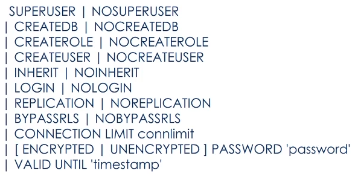

### Excluir uma role

````plsql
DROP ROLE role_specification;
````

### Prática

Criar a role Professor:

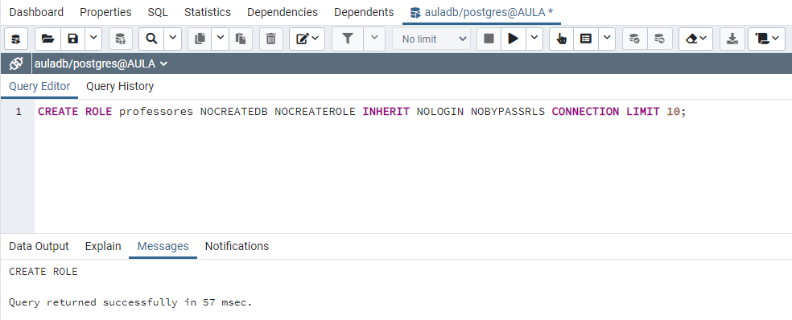

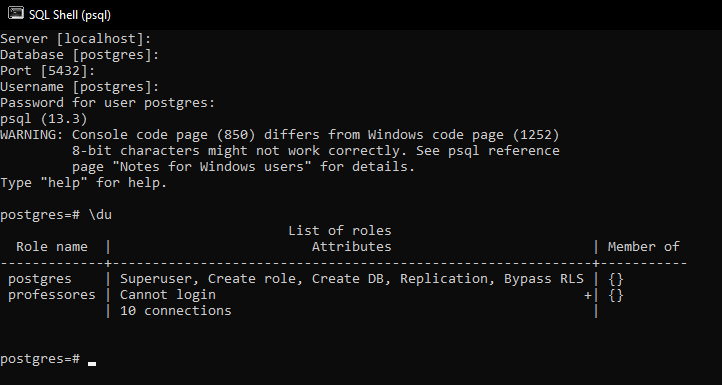

Alterar a role professor:

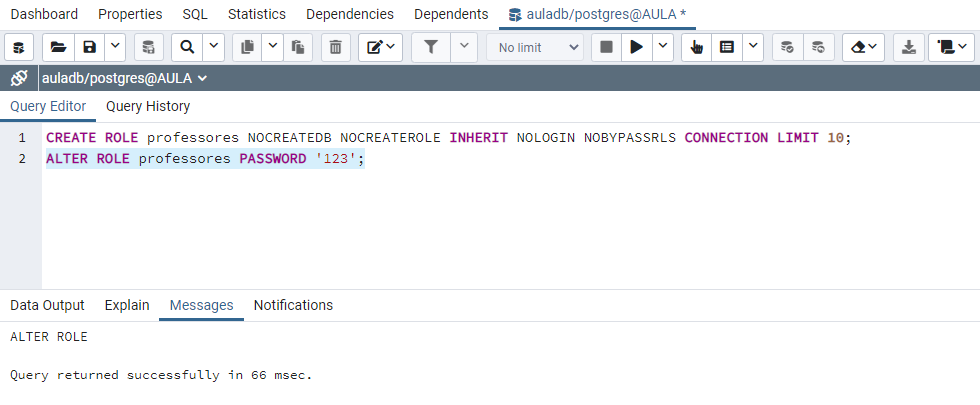

Criar uma role associada a outra:

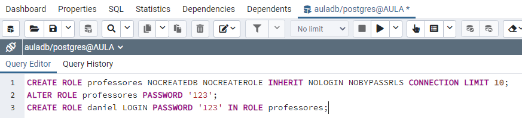

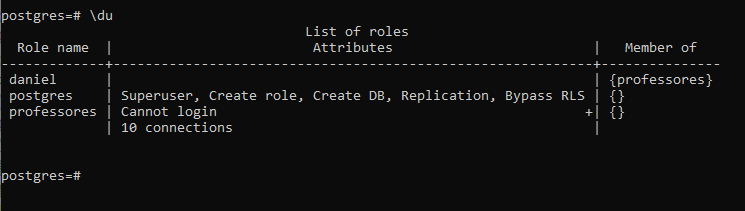

### Administrando acessos (GRANT)

São privilégios de acesso aos objetos de banco de dados.

**Privilégios:**

|  Tabela  |       Database       |   Function   |   Schema   |
| :------: | :------------------: | :----------: | :--------: |
|  coluna  |        domain        |   language   | tablespace |
| sequence | foreign data wrapper | large object |    type    |
|          |    foreign server    |              |            |

````plsql
-- DATABASE
GRANT {{CREATE | CONNECT | TEMPORARY | TEMP}[, ...] | ALL [PRIVILEGES]} ON DATABA database_name [, ...] TO role_sprecification [, ...] [WITH GRANT OPTION]

--SCHEMA
GRANT {{CREATE | USAGE} [, ...] | ALL [PRIVILEGES]} ON SCHEMA schema_name [, ...] TO role_specification [, ...] [WITH GRANT OPTION]

-- TABLE
GRANT {{SELECT | INSERT | UPDATE | DELETE | TRUNCATE | REFERENCES | TRIGGER} [, ...] | ALL [PRIVILEGES]} ON {[TABLE] table_name[, ...] | ALL TABLES IN SCHEMA schema_name[, ...]} TO role_specification [, ...] [WITH GRANT OPTION]
````

**REVOKE** - Retira as permissões da role

````plsql
-- DATABASE
REVOKE [GRANT OPTION FOR] {{CREATE | CONNECT | TEMPORARY | TEMP}[,...] | ALL [PRIVILEGES]} ON DATABA database_name [,...] FROM {[GROUP] role_name | PUBLIC}[,...][CASCADE | RESTRICT]

--SCHEMA
REVOKE [GRANT OPTION FOR] {{CREATE | USAGE} [,...] | ALL [PRIVILEGES]} ON SCHEMA schema_name [,...] FROM {[GROUP] role_name | PUBLIC}[,...][CASCADE | RESTRICT]

-- TABLE
REVOKE [GRANT OPTION FOR] {{SELECT | INSERT | UPDATE | DELETE | TRUNCATE | REFERENCES | TRIGGER} [,...] | ALL [PRIVILEGES]} ON {[TABLE] table_name[,...] | ALL TABLES IN SCHEMA schema_name[,...]} FROM {[GROUP] role_name | PUBLIC}[,...][CASCADE | RESTRICT]
````

**Revogando todas as permissões (simplificado)**

REVOKE ALL ON TABLE IN SCHEMA [schema] FROM [role];

REVOKE ALL ON SCHEMA [schema] FROM [role];

REVOKE ALL ON DATABASE [database] FROM [role];

**Prática**

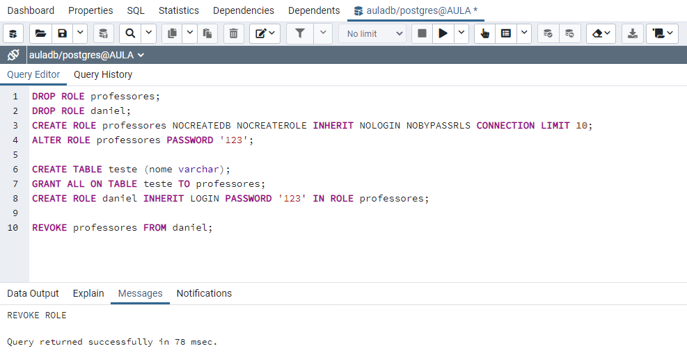

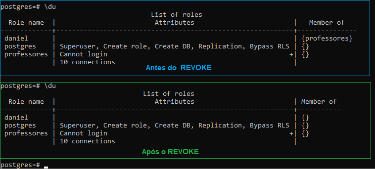

## Objetos e comandos do banco de dados

### Database

É o banco dedados. Grupo de schemas e seus objetos, como tabelas, types, views, funções, entre outros. Seus schemas e objetos não podem ser compartilhados entre si. Cada database é separado um do outro compartilhando apenas usuários/roles e configurações de cluster PostgreSQL.

### Schemas

É um grupo de objetos , como tabelas, types, views, funções, entre outros. É possível relacionar objetos entre diversos schemas. Por exemplo: schema public e schema curso podem ter tabelas com o mesmo nome (teste por exemplo) relacionando-se entre si.

### Objetos

São as tabelas, views, funções, types, sequence, entre outros, pertencentes aos schemas.

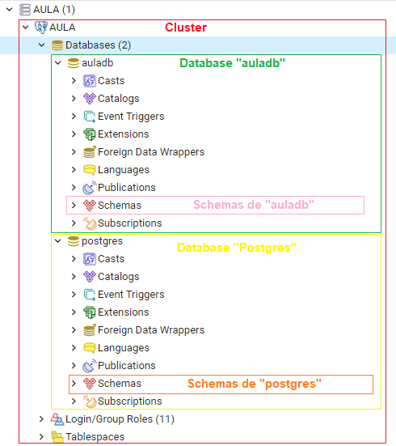

#### Comandos Database

**CREATE DATABASE name **
	 [ [ WITH ] [ OWNER user_name I 
 		[ TEMPLATE [=] template ] 
 		[ ENCODING [=] encoding ] 
 		[ LC_COLLATE [=] Ic_collate ] 
 		[ LC_CTYPE [=] Ic_ctype ] 
		 [ TABLESPACE [=] tablespace_name ] 
 		[ ALLOW_CONNECTIONS [=] allowconn ] 
		 [ CONNECTION LIMIT [=] connlimit ] 
 		[ IS_TEMPLATE [=] istemplate ] ] 

**ALTER DATABASE name RENAME TO new_name **
 ALTER DATABASE name OWNER TO { new_owner I CURRENT_USER I SESSION_USER } 
 ALTER DATABASE name SET TABLESPACE new_tablespace 

**DROP DATABASE [nome)**

#### Comandos Schema

**CREATE SCHEMA schema_name [ AUTHORIZATION role_specification ]**

**ALTER SCHEMA name RENAME TO new_name **
ALTER SCHEMA nome OWNER TO { new_owner | CURRENT_USER | SESSION_USER } 

**DROP SCHEMA [nome) **

**Melhores práticas **

**CREATE SCHEMA IF NOT EXISTS schema_name [ AUTHORIZATION role_specificafion ]** 
**DROP SCHEMA IF EXISTS [nome];**

#### Tabelas, Colunas e tipos de dados

Conjuntos de dados dispostos em colunas e linhas referentes a um objeto comum.

As colunas são consideradas como "campos da tabela", como atributos da tabela.

As linhas de uma tabela são chamadas também de tuplas, e é onde estão contidos os valores, os dados.

Exemplo:

TABELA = automovel

COLUNA 1 = tipo (carro, moto, aviao, helicoptero)

COLUNA 2 = ano_fabricacao (2010, 2011, 2020)

COLUNA 3 = capacidade_pessoas (1, 2, 350)

COLUBA 4 = fabricante (honda, avianca, yamaha)

TABELA = produto

COLUNA 1 = codigo serial do produto

COLUNA 2 = tipo (vestuário, eletronico, beleza)

COLUNA 3 = preco

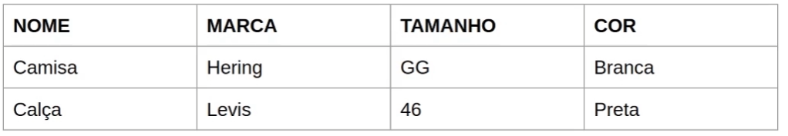

#### Primary key / Chave Primária / PK

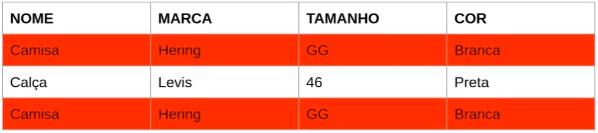

No conceito de modelo de dados relacional e obedecendo as regras de normalização, uma PK é um conjunto de um ou mais campos que nunca se repetem em uma tabela e que seus valores garantem a integridade do dado único e a utilização dos mesmo como referência para o relacionamento entre demais tabela.

- Não pode haver duas ocorrências e uma mesma entidade com o mesmo conteúdo na PK
- A chave primária não pode ser composta por atributo opcional, ou seja, atributo que aceite nulo.
- Os atributos identificadores devem ser o conjunto mínimo que pode identificar cada instância de uma entidade.
- Não devem ser usadas chaves externas.
- Não deve conter informação volátil. 

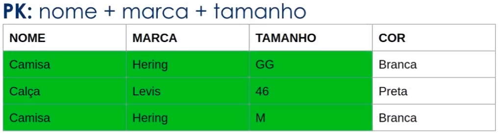

#### Foreign Key / Chave Estrangeira / FK

Campo, ou conjunto de campos que são referências de chaves primárias de outras tabelas ou da mesma tabela. Sua principal função é garantir a integridade referencial entre tabelas.

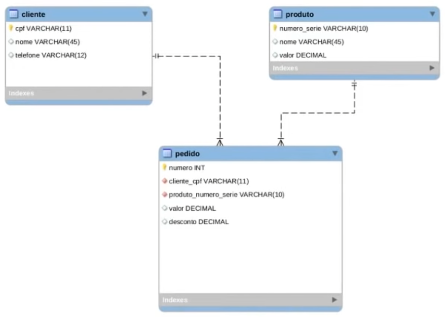

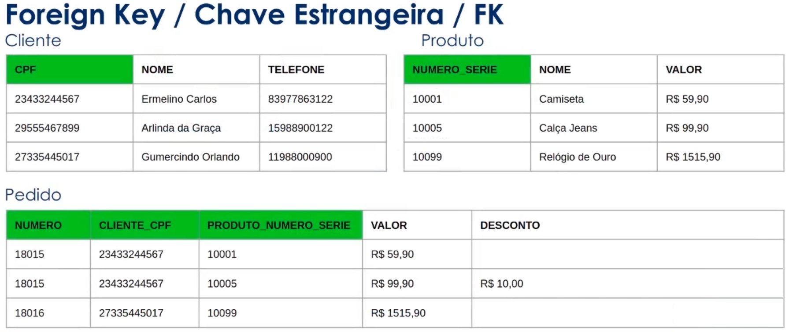

Dica: Adicionar uma coluna nova chamada de "ID".

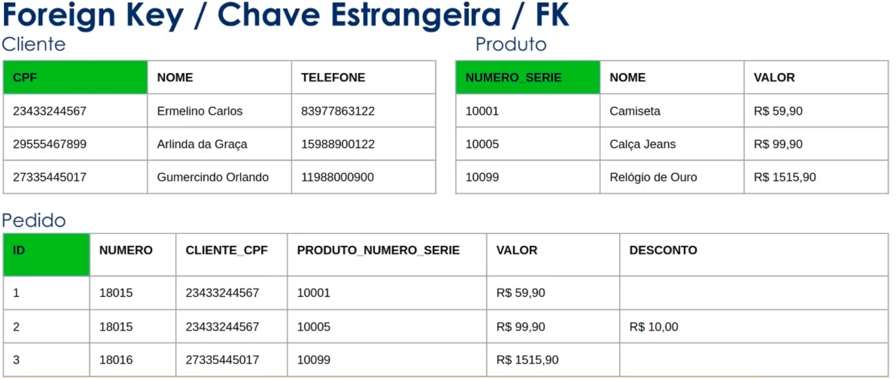

#### Tipos de dados

**Numeric Types **
Monetary Types 
**Character Types **
Binary Data Types 
**Date/Time Types **
**Boolean Type **
Enumerated Types 
Geometric Types 
Network Address Types 
Bit String Types 
Text Search Types 
UIJID Type 
XML Type 
JSON Types 
Arrays 
Composite Types 
Range Types 
Domain Types 
Object Identifier Types 
pg_lsn Type 
Pseudo-Types

**Numéricos**

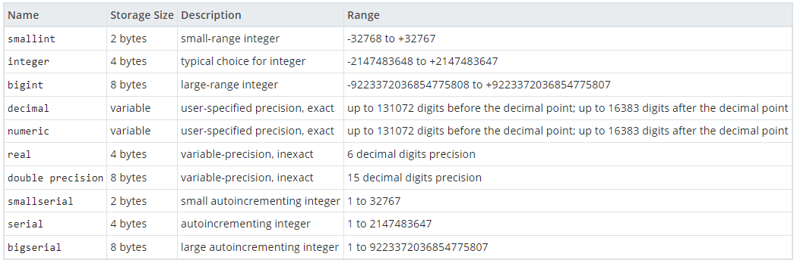

**Caracteres**

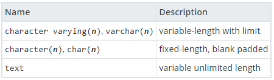

**Data**

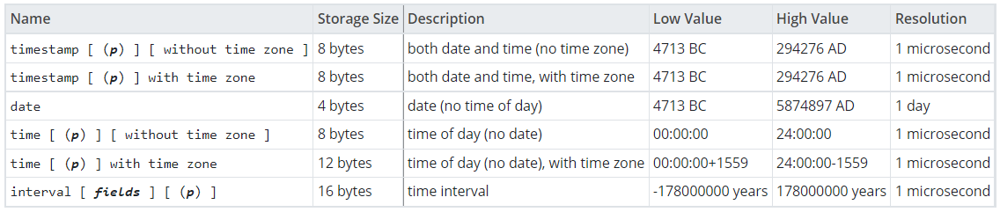

**Booleanos**

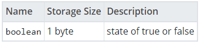

### DML e  DDL

#### **DML:** Data manipulation Language (Linguagem de manipulação de dados)

INSERT, UPDATE, DELETE, SELECT

*O SELECT, alguns consideram como DML, outros como DQL, que significa data query language, ou linguagem de consulta de dados.

````sql
-- INSERT
INSERT INTO [nome da tabela] ([campos da tabela,]) 
VALUES ([valores de acordo com a ordem dos campos acima,]); 

INSERT INTO [nome da tabela] ([campos da tabela,]) 
SELECT [valores de acordo com a ordem dos campos acima,];

INSERT INTO banco (codigo, nome, data_criacao) 
VALUES (100, 'Banco do Brasil', now()); 
INSERT INTO banco (codigo, nome, data_criacao) 
SELECT 100, 'Banco do Brasil', now();
````

````sql
-- UPDATE
UPDATE 
UPDATE [nome da tabela] SET 
[campo1] = [novo valor do campo1], 
[camp02] = [novo valor do camp02], 
...
[WHERE + condições] 
-- ATENÇÃO: muito cuidado com os updates. Sempre utilize-os com condição.

UPDATE banco SET 
codigo = 500 
WHERE codigo = 100; 
UPDATE banco SET 
data_criacao = now() 
WHERE data criacao IS NULL;
````

````sql
-- DELETE
DELETE FROM [nome da tabela] 
[WHERE + condições] 
-- ATENÇÃO: muito cuidado com os deletes. Sempre utilize-os com condição.
DELETE FROM banco 
WHERE codigo = 512; 
DELETE FROM banco 
WHERE nome = 'Conta Digital';
````

````sql
-- SELECT
SELECT [campos da tabela] 
FROM [nome da tabela] 
[WHERE + condicoes] 
-- DICAS DE BOAS PRÁTICAS: Evite sempre que puder o "SELECT *"

SELECT codigo, nome 
FROM banco; 

SELECT codigo, nome 
FROM banco 
WHERE data criacao > '2019-10-15 15:00:00';
````

#### **DDL:** Data Definition Language (Linguagem de definição de dados)

CREATE / ALTER / DROP 
CREATE [objeto] [nome do objeto] [opções]; 
ALTER [objeto] [nome do objeto] [ opções]; 
DROP [objeto] [nome do objeto] [opções];

````sql
CREATE DATABASE dadosbancarios; 
ALTER DATABASE dadosbancarios OWNER TO diretoria; 
DROP DATABASE dadosbancarios;

CREATE SCHEMA IF NOT EXISTS bancos; 
ALTER SCHEMA bancos OWNER TO diretoria; 
DROP SCHEMA IF EXISTS bancos;
````

`````sql
-- CREATE / ALTER / DROP - TABELAS 
CREATE TABLE [IF NOT EXISTS] [nome da tabela] ( 
[nome do campo] [tipo] [regras] [opções], 
[nome do campo] [tipo] [regras] [opções], 
[nome do campo] [tipo] [regras] [opções] 
);    
ALTER TABLE [nome da tabela] [opções]; 
DROP TABLE [nome da table];
`````

`````sql
-- EXEMPLO: CREATE / ALTER / DROP - TABELAS
-- Definindo Primary Key em uma linha 
CREATE TABLE IF NOT EXISTS banco ( 
	codigo INTEGER PRIMARY KEY, 
	nome VARCHAR(50) NOT NULL, 
	data_criacao TIMESTAMP NOT NULL DEFAULT NOW() 
    );
-- Definindo Primary Key em linha separa    
CREATE TABLE IF NOT EXISTS banco ( 
	codigo INTEGER, 
	nome VARCHAR(50) NOT NULL, 
	data_criacao TIMESTAMP NOT NULL DEFAULT NOW(), 
	PRIMARY KEY (codigo) 
    );
-- Adicionar uma coluna na tabela banco    
ALTER TABLE banco ADD COLUMN tem_poupanca BOOLEAN; 
DROP TABLE IF EXISTS banco;
`````

### Prática

**Iniciando um novo Banco de Dados**

````sql
-- Criando um novo database:
CREATE DATABASE financas;
````

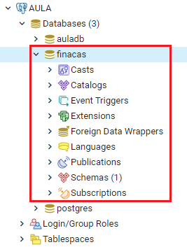

**Criando tabelas:**

````sql
--  Criando uma nova tabela com nome "banco":
CREATE TABLE IF NOT EXISTS banco (
	numero INTEGER NOT NULL,
	nome VARCHAR(50) NOT NULL,
	ativo BOOLEAN NOT NULL DEFAULT TRUE,
	data_criacao TIMESTAMP NOT NULL DEFAULT CURRENT_TIMESTAMP,
	PRIMARY KEY (numero)
);

-- Criando uma nova tabela com nome "agencia" e com uma Foreign Key:
CREATE TABLE IF NOT EXISTS agencia (
	banco_numero INTEGER NOT NULL,
	numero INTEGER NOT NULL,
	nome VARCHAR(80) NOT NULL,
	ativo BOOLEAN NOT NULL DEFAULT TRUE,
	data_criacao TIMESTAMP NOT NULL DEFAULT CURRENT_TIMESTAMP,
	PRIMARY KEY (banco_numero,numero),
	FOREIGN KEY (banco_numero) REFERENCES banco (numero)
); 

-- Criando uma nova tabela chamada "cliente", com a Primary Key sendo definida no inicio:
CREATE TABLE cliente (
	numero BIGSERIAL PRIMARY KEY,
	nome VARCHAR(120) NOT NULL,
	email VARCHAR(250) NOT NULL,
	ativo BOOLEAN NOT NULL DEFAULT TRUE,
	data_criacao TIMESTAMP NOT NULL DEFAULT CURRENT_TIMESTAMP
);

-- Criando a tabela "conta_corrente":
CREATE TABLE conta_corrente (
	banco_numero INTEGER NOT NULL,
	agencia_numero INTEGER NOT NULL,
	numero BIGINT NOT NULL,
	digito SMALLINT NOT NULL,
	cliente_numero BIGINT NOT NULL,
	ativo BOOLEAN NOT NULL DEFAULT TRUE,
	data_criacao TIMESTAMP NOT NULL DEFAULT CURRENT_TIMESTAMP
	PRIMARY KEY (banco_numero,agencia_numero,numero,digito,cliente_numero),
	FOREIGN KEY (banco_numero,agencia_numero) REFERENCES agencia (banco_numero,numero),
	FOREIGN KEY (cliente_numero) REFERENCES cliente (numero)
);

-- Criando a tabela "tipo_transacao":
CREATE TABLE tipo_transacao (
	id SMALLINT PRIMARY KEY,
	nome VARCHAR(50) NOT NULL,
	ativo BOOLEAN NOT NULL DEFAULT TRUE,
	data_criacao TIMESTAMP NOT NULL DEFAULT CURRENT_TIMESTAMP	
);

-- Criando a tabela "cliente_transacao":
CREATE TABLE cliente_transacao (
	id BIGSERIAL PRIMARY KEY,
	banco_numero INTEGER NOT NULL,
	agencia_numero INTEGER NOT NULL,
	conta_corrente_numero BIGINT NOT NULL,
	conta_corrente_digito SMALLINT NOT NULL,
	cliente_numero BIGINT NOT NULL,
	tipo_transacao_id SMALLINT NOT NULL,
	valor NUMERIC(15,2) NOT NULL,
	data_criacao TIMESTAMP NOT NULL DEFAULT CURRENT_TIMESTAMP
	FOREIGN KEY (banco_numero,agencia_numero,conta_corrente_numero,conta_corrente_digito,cliente_numero) REFERENCES conta_corrente(banco_numero,agencia_numero,numero,digito,cliente_numero)
);
````

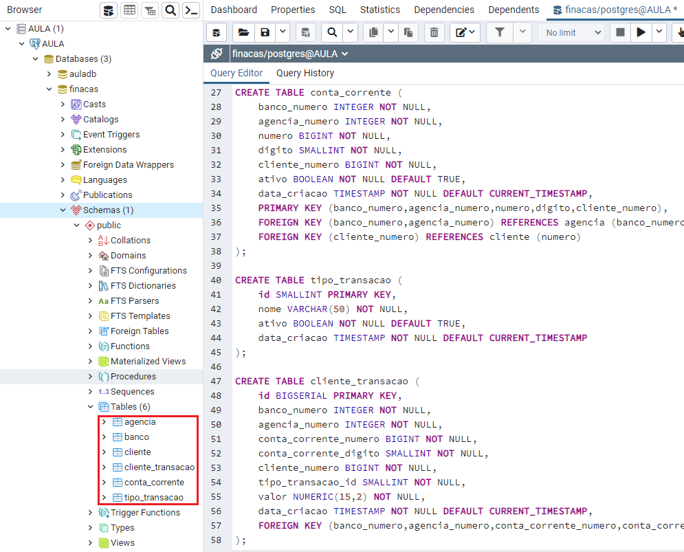

