# Fundamentos da Structured Query Language (SQL)

## Conheça o DML  e o Truncate

### Revisão

**IDEMPOTÊNCIA:** Propriedade que algumas ações/operações possuem possibilitando-as de serem executadas diversas vezes sem alterar o resultado após a aplicação inicial.

**Melhores práticas em DDL**

Importante as tabelas possuírem campos que realmente serão utilizados e que sirvam de atributo direto a um objetivo em comum.

- Criar/Acrescentar colunas que são "atributos básicos" do objeto;
- Cuidado com regras (constraints);
- Cuidado com o excesso de FKs;
- Cuidado com o tamanho indevido de colunas. Exemplo: coluna CEP VARCHAR(255);

### DML - CRUD

#### **SELECT**

SELECT (campos,)

FROM tabela

[condições]

Exemplo:

`````sql
SELECT numero, nome FROM banco;
SELECT numero, nome FROM banco WHERE ativo IS TRUE;
SELECT nome FROM cliente WHERE email LIKE '%gmail.com';

SELECT numero FROM agencia
WHERE banco_numero IN (SELECT numero FROM banco WHERE nome ILIKE '%Bradesco%';
`````

**Condições (WHERE / AND / OR)**

WHERE (coluna | condição)

- =
- \> | >=
- < | <=
- <> | !=
- LIKE
- ILIKE 
- IN

Primeira condição sempre **WHERE**

Demais condições, **AND** ou **OR**.

````SQL
-- SELECT - Idempotência
SELECT (campos,)
FROM tabela1
WHERE EXISTS (
	SELECT (campos,)
    FROM tabela2
    WHERE campo1 = valor1
    [AND/OU campoN = valorN]
);
-- Não é uma boa prática.
-- Melhor prática utilizar LEFT JOIN.
````

**SELECT * (Evitar)**

Diferença de tamanho entre "SELECT * " e "SELECT id".

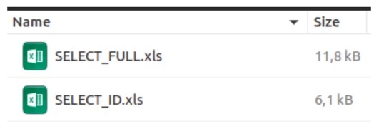

Consulta com SELECT id:

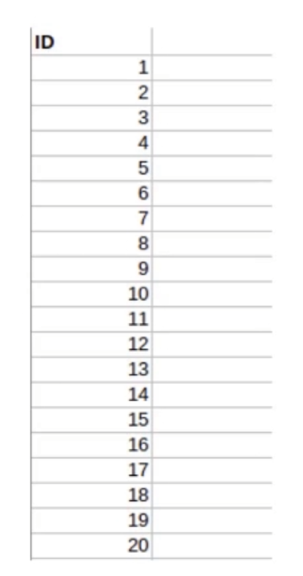

Consulta com SELECT * :

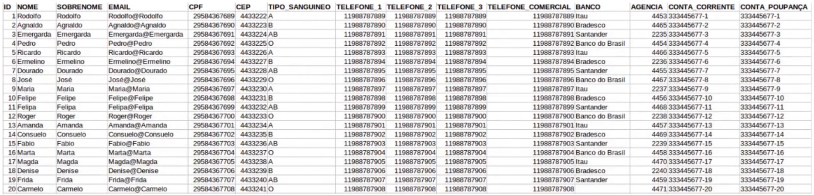

#### **INSERT**

````sql
INSERT (campos da tabela,) VALUES (valores,);
INSERT (campos da tabela,) SELECT (valores,);
````

````SQL
-- INSERT - IDEMPOTÊNCIA
INSERT INTO agencia (banco_numero, numero, nome) VALUES (341 ,1,'Centro da cidade');

INSERT INTO agencia (banco_numero, numero, nome) 
SELECT 341,1,'Centro da cidade' 
WHERE NOT EXISTS (SELECT banco_numero,numero,nome FROM agencia WHERE banco_numero = 341 AND numero = 1 AND nome = 'Centro da cidade');

-- ON CONFLICT (Recomendado)
INSERT INTO agencia (banco_numero,numero,nome) VALUES (341,1,'Centro da cidade') ON CONFLICT (banco_numero,numero) DO NOTHING;
````

#### **UPDATE**

`````SQL
UPDATE (tabela) SET campo1 = novo_valor WHERE (condição);
`````

#### **DELETE**

````SQL
DELETE FROM (tabela) SET campo1 = novo_valor WHERE (condição);
````

### TRUNCATE

"Esvazia" a tabela.

````SQL
TRUNCATE [TABLE] [ONLY] name [*] [, ...] [RESTART IDENTITY | CONTINUE IDENTITY] [CASCADE | RESTRICT]
````

### Prática

**Inserindo os dados: **

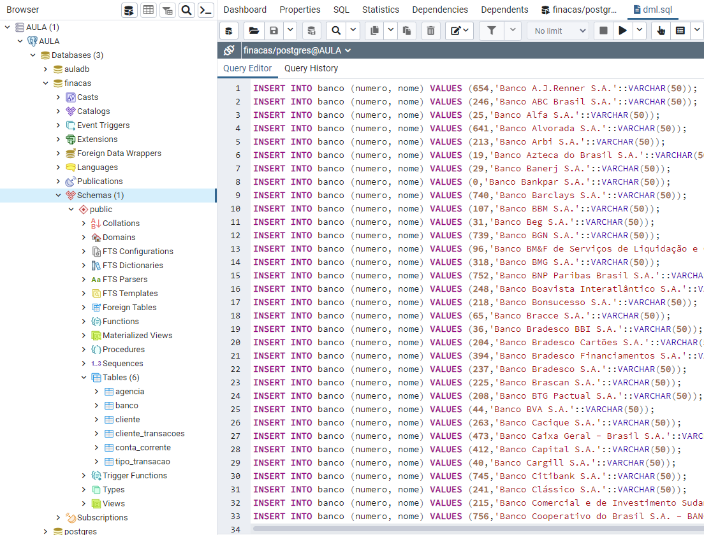

**Consultando com SELECT:**

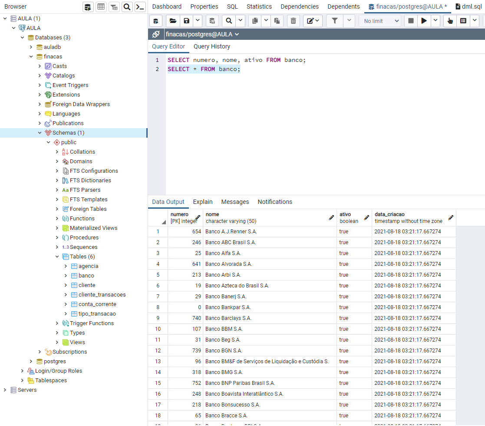

**Testes:**

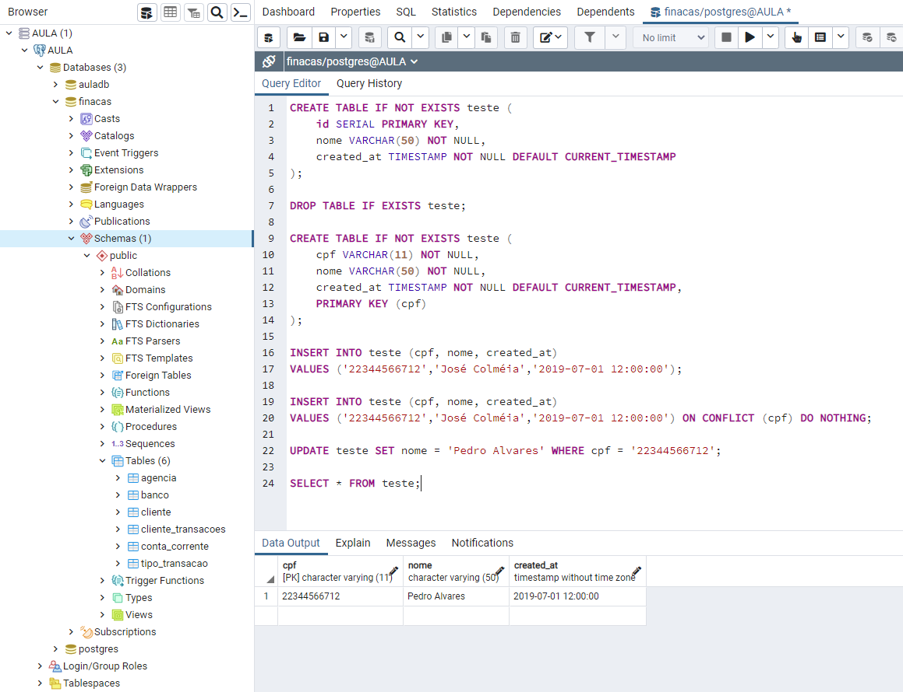

## Funções agregadas em PostgreSQL

````sql
-- Obs: Buscar atributos da tabela.
SELECT column_name, data_type FROM information_schema.columns WHERE table_name = 'banco';
````

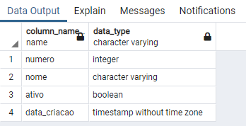

### AVG (Média)

````sql
SELECT AVG(valor) FROM cliente_transacoes;
````

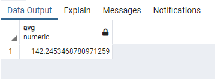

### COUNT (opção: HAVING)

````sql
SELECT COUNT(numero), email
FROM cliente
WHERE email ILIKE '%gmail.com'
GROUP BY email;
````

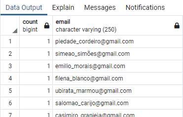

````sql
SELECT COUNT(id), tipo_transacao_id
FROM cliente_transacoes
GROUP BY tipo_transacao_id
HAVING COUNT(id) > 150;
````

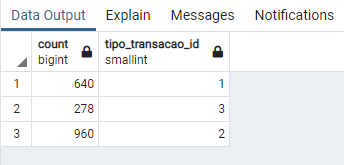

### MAX

````sql
SELECT MAX(valor), tipo_transacao_id
FROM cliente_transacoes
GROUP BY tipo_transacao_id;
````

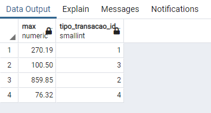

### MIN

````sql
SELECT MIN(valor)
FROM cliente_transacoes;
````

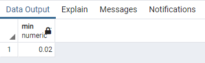

### SUM

````SQL
SELECT SUM(valor), tipo_transacao_id
FROM cliente_transacoes
GROUP BY tipo_transacao_id;
````

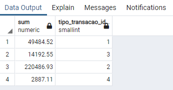

````sql
SELECT SUM(valor), tipo_transacao_id
FROM cliente_transacoes
GROUP BY tipo_transacao_id
ORDER BY tipo_transacao_id ASC;

SELECT SUM(valor), tipo_transacao_id
FROM cliente_transacoes
GROUP BY tipo_transacao_id
ORDER BY tipo_transacao_id DESC;
````

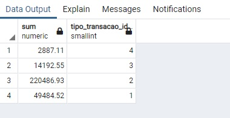

## Trabalhando com JOINs

### JOIN


````SQL
SELECT tabela_1.campos, tabela_2.campos
FROM tabela_1
JOIN tabela_2
	ON tabela_2.campo = tabela_1.campo
````

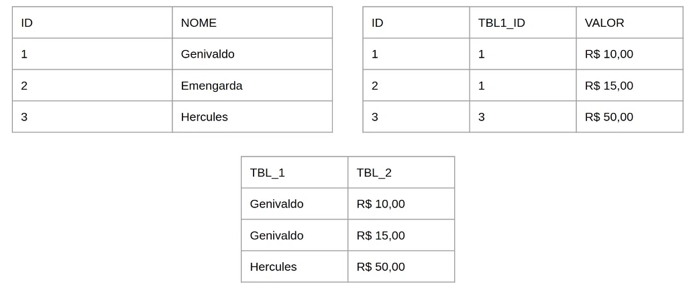

````sql
SELECT banco.numero, banco.nome, agencia.numero, agencia.nome
FROM banco
JOIN agencia ON agencia.banco_numero = banco.numero;
-- Data Output: Todas as agencias relacionadas ao banco
````


````sql
SELECT banco.numero
FROM banco
JOIN agencia ON agencia.banco_numero = banco.numero
GROUP BY banco.numero;
-- Data Output: Número dos bancos que possuem agencia
````


````sql
SELECT count(distinct banco.numero)
FROM banco
JOIN agencia ON agencia.banco_numero = banco.numero;
````


````sql
SELECT banco.nome, agencia.nome, conta_corrente.numero, conta_corrente.digito, cliente.nome
FROM banco
JOIN agencia ON agencia.banco_numero = banco.numero
JOIN conta_corrente
	-- ON conta_corrente.banco_numero = agencia.banco_numero
	ON conta_corrente.banco_numero = banco.numero
	AND conta_corrente.agencia_numero = agencia.numero
JOIN cliente
	ON cliente.numero = conta_corrente.cliente_numero;
````


### LEFT JOIN


````sql
SELECT tabela_1.campos, tabela_2.campos
FROM tabela_1
LEFT JOIN tabela_2
	ON tabela_2.campo = tabela_1.campo
````

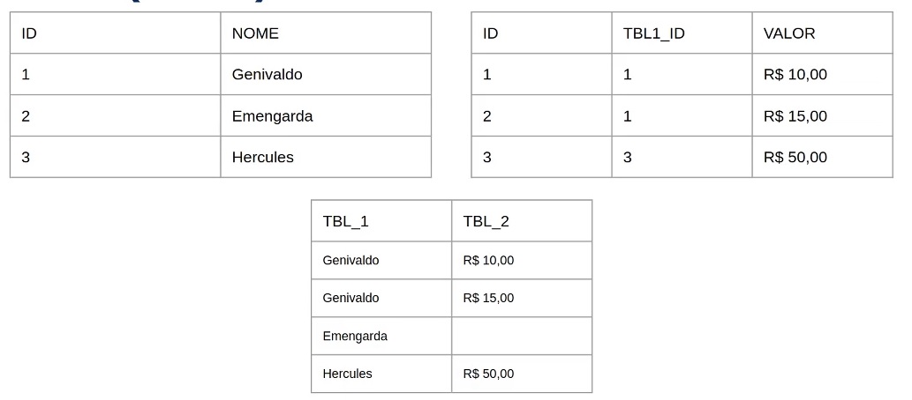

````sql
SELECT banco.numero, banco.nome, agencia.numero, agencia.nome
FROM banco
LEFT JOIN agencia ON agencia.banco_numero = banco.numero;
````

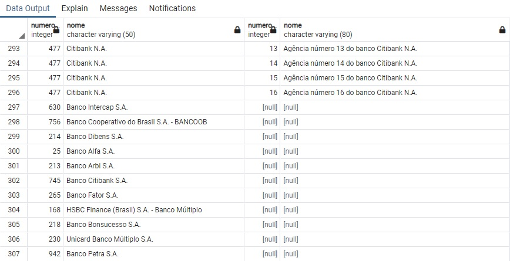

### RIGHT JOIN


````sql
SELECT tabela_1.campos, tabela_2.campos
FROM tabela_1
RIGHT JOIN tabela_2
	ON tabela_2.campo = tabela_1.campo
````

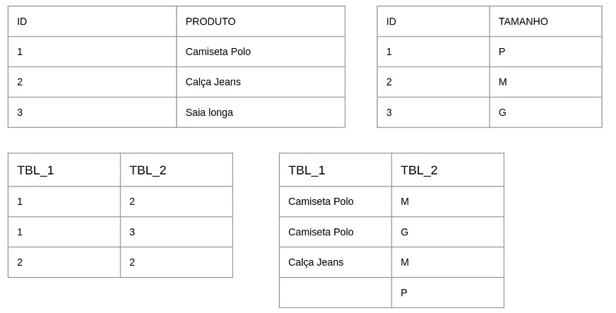

````sql
SELECT agencia.numero, agencia.nome, banco.numero, banco.nome
FROM agencia
RIGHT JOIN banco ON banco.numero = agencia.banco_numero;
````

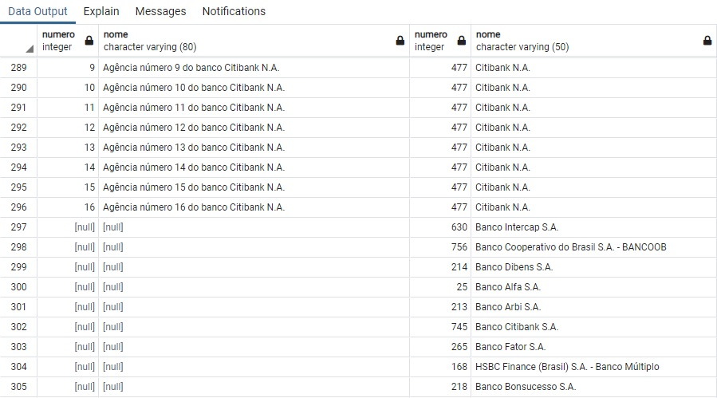

### FULL JOIN


````SQL
SELECT tabela_1.campos, tabela_2.campos
FROM tabela_1
FULL JOIN tabela_2
	ON tabela_2.campo = tabela_1.campo
````

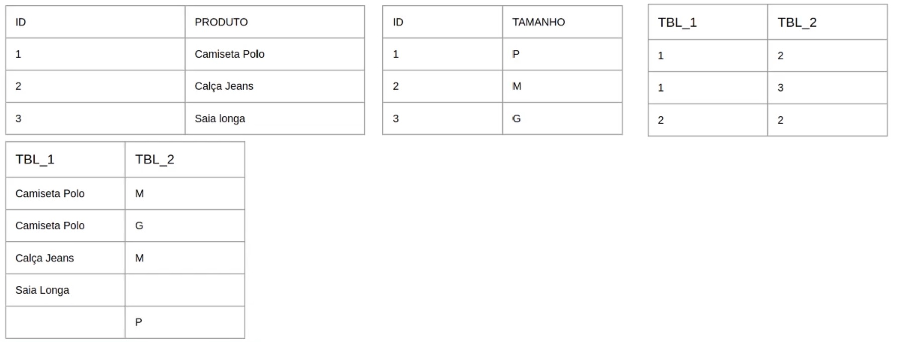

````sql
SELECT banco.numero, banco.nome, agencia.numero, agencia.nome
FROM banco
FULL JOIN agencia ON agencia.banco_numero = banco.numero;
-- O resultado mostrará todas as relações e todos os itens sem relações
````

### CROSS JOIN

Todos os dados de uma tabela serão cruzados com todos os dados da tabela referenciada no CROSS JOIN criando uma matriz.

````sql
SELECT tabela_1.campos, tabela_2.campos
FROM tabela_1
CROSS JOIN tabela_2
````

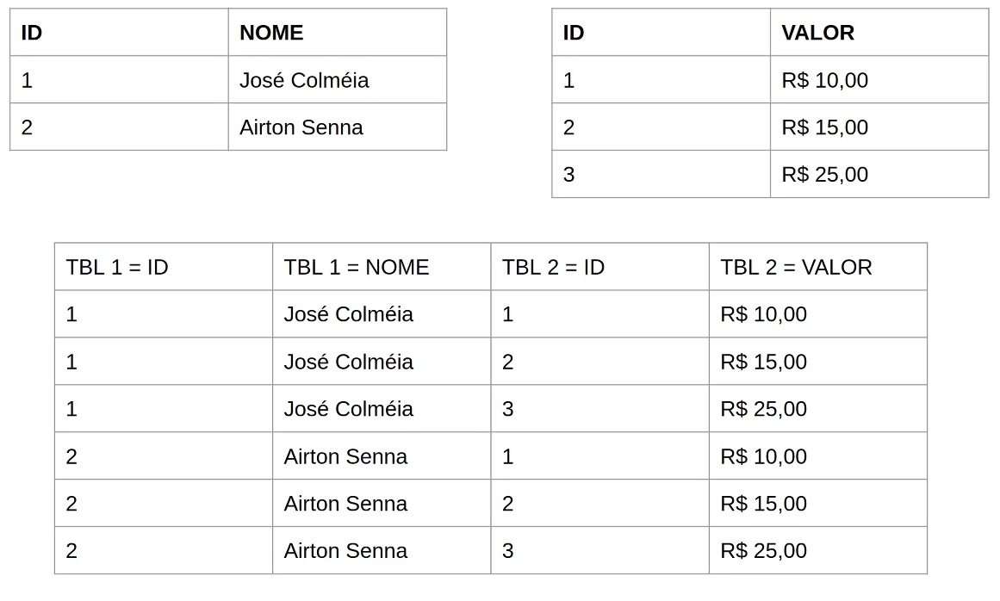

````sql
CREATE TABLE IF NOT EXISTS teste_a (id serial primary key, valor varchar(10));
CREATE TABLE IF NOT EXISTS teste_b (id serial primary key, valor varchar(10));

INSERT INTO teste_a (valor) VALUES ('teste1');
INSERT INTO teste_a (valor) VALUES ('teste2');
INSERT INTO teste_a (valor) VALUES ('teste3');
INSERT INTO teste_a (valor) VALUES ('teste4');

INSERT INTO teste_b (valor) VALUES ('teste_a');
INSERT INTO teste_b (valor) VALUES ('teste_b');
INSERT INTO teste_b (valor) VALUES ('teste_c');
INSERT INTO teste_b (valor) VALUES ('teste_d');

SELECT tbla.valor, tblb.valor
FROM teste_a tbla
CROSS JOIN teste_b tblb;
````

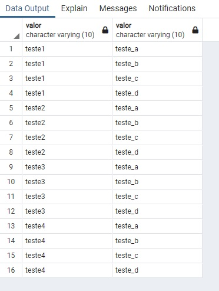

## Otimizando o código com CTE

### Definição

Forma auxiliar de organizar "statements", ou seja, bloco de códigos, para consultas muito grandes, gerando tabelas temporárias e criando relacionamentos entre elas.

Dentro dos statements podem ter SELECTs, INSERTs, UPDATEs ou DELETEs.

### WITH STATEMENTS

````sql
WITH [nome1] AS ( 
	SELECT (campos,) 
	FROM tabela_A 
	[WHERE] 
), [nome2] AS ( 
	SELECT (campos,) 
	FROM tabela B 
	[WHERE] 
SELECT [nome1].(campos,), [nome2].(campos,) 
FROM [nomel] 
JOIN [nome2] ....
````

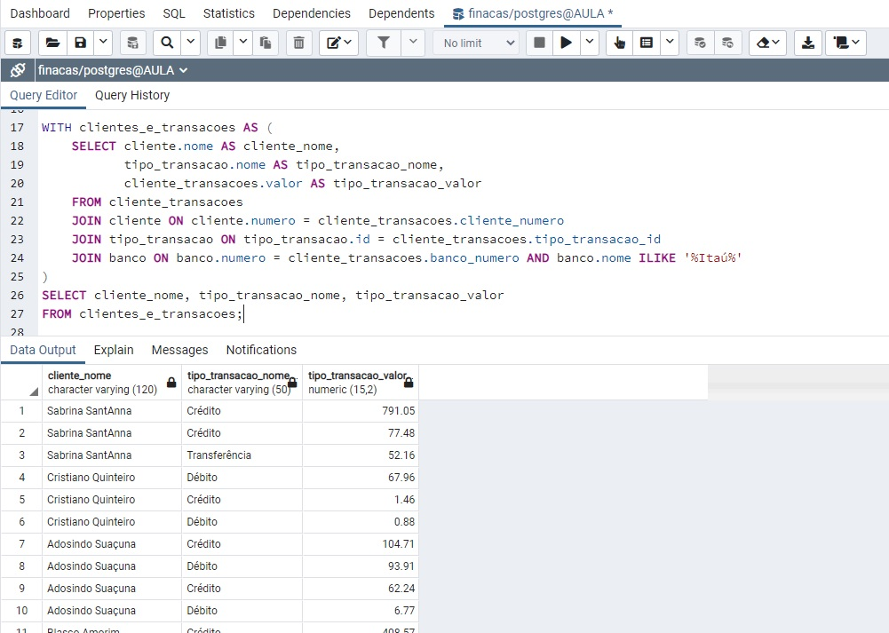

