# Objetos e tipos de dados do PostgreSQL

### O arquivo postgresql.conf

**Definição**

Arquivo onde estão definidas e armazenadas todas as configurações do servidor PostgreSQL. Alguns parâmetros só podem ser alterados com uma reinicialização do banco de dados. A view pg_settings, acessada por dentro do banco de dados, guarda todas as configurações atuais.

**postgresql.conf**

Ao acessar a view pg_settings, é possível visualizar todas as configurações atuais:

````sql
SELECT name, setting
FROM pg_settings;
````

Ou é possível usar o comando:

````sql
SHOW [parâmetro];
````

**Localização do arquivo postgresql.conf**

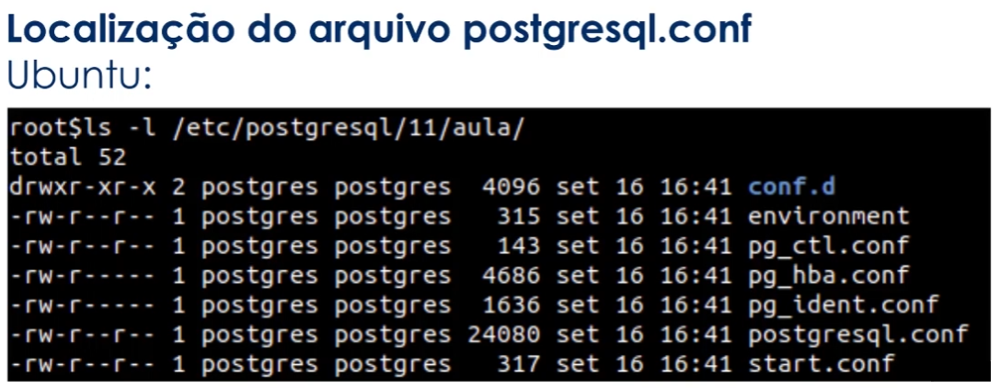

Por padrão, encontra-se dentro do diretório PGDATA definido no momento da inicialização do cluster de banco de dados.

No sistema operacional Ubuntu, se o PostgreSQL foi instalado a partir do repositório oficial, o local do arquivo postgresql.conf será diferente do diretório de dados.

````bash
/etc/postgressql/[versão]/[nome do cluster]/postgresql.conf
````


**Configurações de conexão**

- **LISTEN_ADDRESSES** - Endereço(s) TCP/IP das interfaces que o servidor PostgreSQL vai escutar/liberar conexões.
- **PORT** - A porta TCP que o servidor PostgreSQL vai ouvir. O padrão é 5432.
- **MAX_CONNECTIONS** - Número máximo de conexões simultâneas no servidor PostgreSQL.
- **SUPERUSER_RESERVED_CONNECTIONS** - Número de conexões (slots) reservados para conexões ao banco de dados de super usuários.
- **AUTRENTICATION_TIMEOUT** - Tempo máximo em segundos para o cliente conseguir uma conexão com o servidor.
- **PASSWORD_ENCRYPTION** - Algoritmo de criptografia das senhas dos novos usuários criados no banco de dados.
- **SSL** - Habilita a conexão criptografada por SSL (Somente se o PostgreSQL foi compilado com suporte SSL).

**Configuração de memória**

- **SHARED_BUFFERS** - Tamanho da memória compartilhada do servidor PostgreSQL para cache/buffer de tabelas, índices e demais relações.
- **WORK_MEM** - Tamanho da memória para operações de agrupamento e ordenação (ORDER BY, DISTINCT, MERGE JOINS).
- **MAINTENANCE_QORK_MEM** - Tamanho da memória para operações como VACUUM, INDEX, ALTER, TABLE.

### O arquivo pg_hba.conf

**Definição**

Arquivo responsável pelo controle de autenticação dos usuários no servidor PostgreSQL.

O formato do arquivo pode ser:

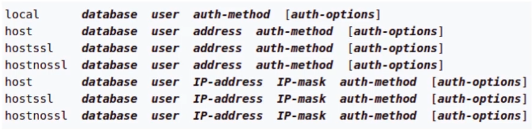

**Métodos de autenticação**

- **TRUST** - (conexão sem requisição de senha)
- **REJECT** - (rejeitar conexões)
- **MD5** - (criptografia md5)
- **PASSWORD** - (Senha sem criptografia)
- **GSS** - (Generic Security Service Application Program Interface)
- **SSPI** - (Security Support Provider Interface - somente para windows)
- **KRB5** - (Kerberos V5)
- **IDENT** - (Utiliza o usuário do sistema operacional do cliente via ident server)
- **PEER** - (Utiliza o usuário do sistema operacional do cliente)
- **LDAP** - (ldap server)
- **RADIUS** - (radius server)
- **CERT** - (Autenticação via certificado ssl do cliente)
- **PAM** - (pluggable authentication modules. O usuário precisa estar no banco de dados)

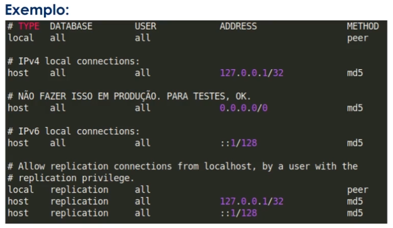

### O arquivo pg_ident.conf

**Definição**

Arquivo responsável por mapear os usuários do sistema operacional com os usuários do banco de dados. Localizado no diretório de dados PGDATA de sua instalação. A opção ident deve ser utilizada no arquivo pg_hba.conf.

 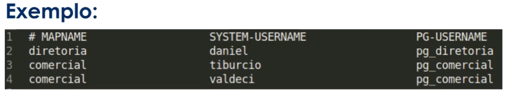

### Comandos administrativos

**Ubuntu:**

````bash
# Listar todos os cluster PostgreSQL
pg_lscluster
# Criar um novo cluster PostgreSQL
pg_createcluster <version> <cluster name>
# Apagar um cluster PostgreSQL
pg_dropcluster <version> <cluster>
# Start, Stop, Status, Restart de clusters PostgreSQL
pg_ctlcluster <version> <cluster> <action>
````

**CentOS:**

````bash
systemctl <action> <cluster>

# Iniciar o cluster PostgreSQL
systemctl start postgresql-13
# Mostra o status do cluster PostgreSQL
systemctl status postgresql-13
# Para o cluster PostgreSQL
systemctl stop postgresql-13
# Restarta o cluster PostgreSQL
systemctl restart postgresql-13
````

**Binários do  PostgreSQL:**

- createdb
- createuser
- dropdb
- dropuser
- initdb
- pg_ctl
- pg_basebackup
- pg_dump / pg_dumpall (Não é backup)
- pg_restore
- psql
- reindexdb
- vacuumdb

### Arquitetura/Hierarquia

**Cluster**

Coleção de bancos de dados que compartilham as mesmas configurações (arquivos de configuração) do PostgreSQL e do sistemas operacional (porta, listen_addresses, etc).

**Banco de dados (database)**

Conjunto de schemas com seus objetos/relações (tabelas, funções, views, etc).

**Schema**

Conjunto de objetos/relações (tabelas, funções, views, etc).

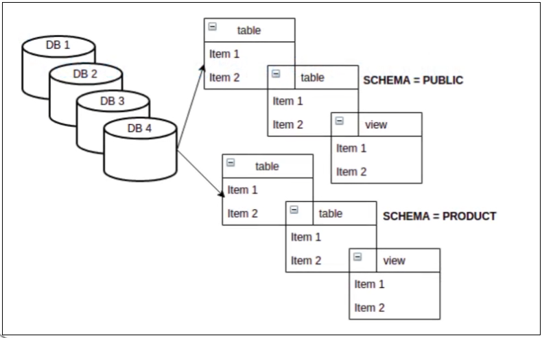


### Conhecendo a ferramenta PGAdmin

**Importante para conexão:**

1. Liberar acesso ao cluster em postgresql.conf.
2. Liberar acesso ao cluster para p usuário do banco de dados em pg_hba.conf.
3. Criar/editar usuários.

**Para liberar acesso:**

Editar o postgresql.conf


Ao iniciar a edição, desce ate "CONNECTIONS AND AUTHENTICATION", como mostra a imagem:

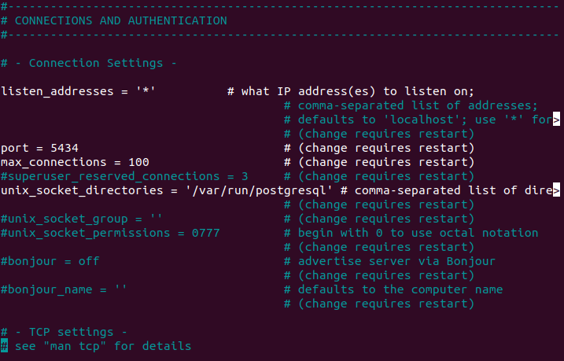

Alterar o listen_addresses para os IP's que poderão se conectar, "*****" significa que todos tem acesso, sendo recomendado usa-lo apenas em testes.


Por fim, iniciar o cluster com "pg_ctlcluster \<version> \<cluster name> start:


Para alterar a senha do usuário postgres, basta acessar o usuário com "sudo su - postgres" e depois o psql, seguindo a imagem:

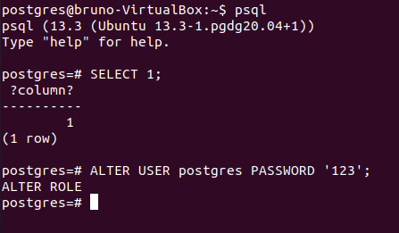

Após isso deve editar o arquivo pg_hba.conf:

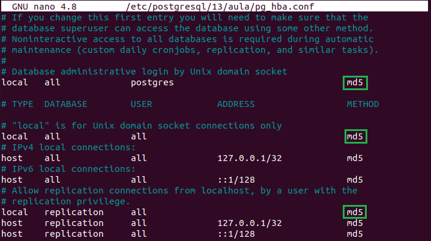

Por padrão, o que está em verde estará escrito "peer", isso significa que para acessar o banco, ele casara o usuário da maquina com o do banco para acessar,  já o "md5" irá pedir uma senha para acessar.

**PgAdmin4**

Primeiro passo é criar um grupo para os servidores:


Criar um server:


Obs: Comentar a finalidade do servidor é uma pratica recomendada.

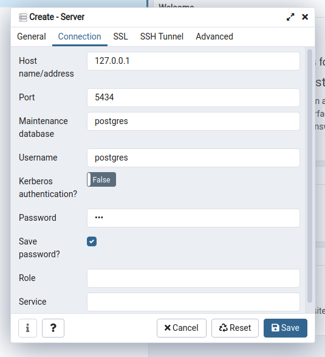

Agora com o grupo e o servidor criado, vamos criar o Banco de dados:


Utilizando Query Tool, vamos executar os seguintes comandos:

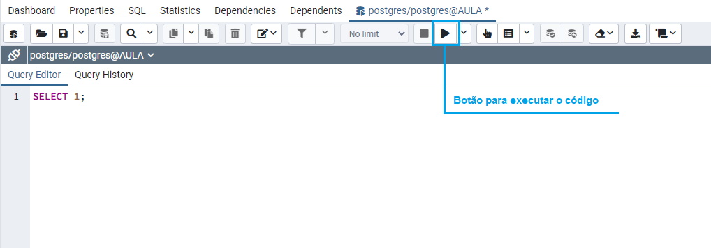

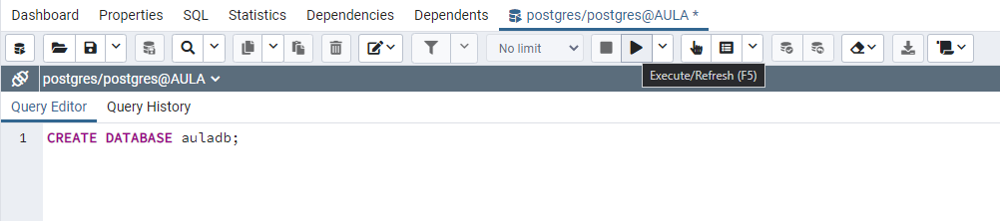

Após ser criado o novo banco de dados não aparecera na lista, sendo necessário um refresh:


## Administração de usuários

### Conceitos  user/roles/groups

Roles (papéis ou funções), users (usuários) e grupo de usuários são "contas", perfis de atuação em um banco de dados, que possuem permissões em comum ou específicas.

Nas versões anteriores do PostgreSQL 8.1, usuários e roles tinham comportamentos diferentes.

Atualmente, roles e user são alias.

É possível que roles pertençam a outras roles;

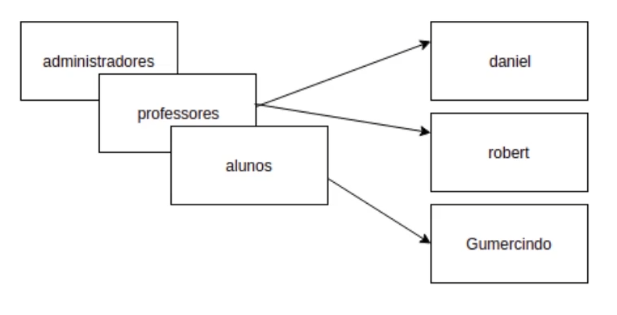

### Administrando user/roles/groups

CREATE ROLE name [WITH] option[...]

Onde option pode ser:

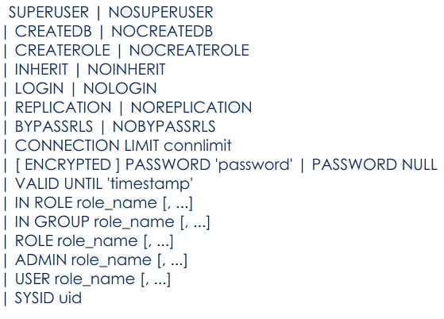

Exemplo:


### Associação entre roles

Quando uma role assume as permissões de outra role. Necessário a opção INHERIT.

No momento de criação da role:

- IN ROLE (passa a pertencer a role informada)
- ROLE (a role informada passa a pertencer a nova role)

Ou após a criação da role:

````sql
GRANT [role a ser concedida] TO [role a assumir as permissões]
````

Exemplo:

`````sql
CREATE ROLE professores
	NOCREATEDB
	NOCRATEROLE
	INHERIT
	NOLOGIN
	NOBYPASSRLS
	CONNECTION LIMIT -1;
`````

````SQL
CREATE ROLE daniel LOGIN CONNECTION LIMIT 1 PASSWORD '123' IN ROLE professores;
````

- A role daniel passa a assumir as permissões da role professores

````sql
CREATE ROLE daniel LOGIN CONNECTION LIMIT 1 PASSWORD '123' ROLE professores;
````

- A role professores passar a fazer parte da role daniel assumindo suas permissões.

````plsql
CREATE ROLE daniel LOGIN CONNECTION LIMIT 1 PASSWORD '123';
GRANT professores TO daniel;
````

### Desassociar membros entre roles

REVOKE [role que será revogada] FROM [role que terá suas permissões revogadas]

````plsql
REVOKE professores FROM daniel;
````

### Alterando uma role

ALTER ROLE role_specification [WITH] option [...]

Onde option pode :


### Excluir uma role

````plsql
DROP ROLE role_specification;
````

### Prática

Criar a role Professor:


Alterar a role professor:


Criar uma role associada a outra:

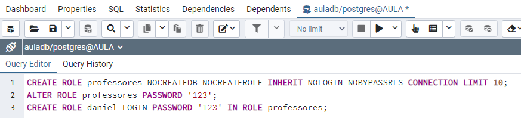

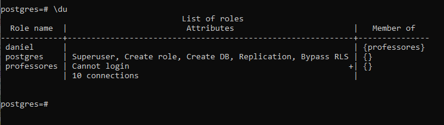

### Administrando acessos (GRANT)

São privilégios de acesso aos objetos de banco de dados.

**Privilégios:**

|  Tabela  |       Database       |   Function   |   Schema   |
| :------: | :------------------: | :----------: | :--------: |
|  coluna  |        domain        |   language   | tablespace |
| sequence | foreign data wrapper | large object |    type    |
|          |    foreign server    |              |            |

````plsql
-- DATABASE
GRANT {{CREATE | CONNECT | TEMPORARY | TEMP}[, ...] | ALL [PRIVILEGES]} ON DATABA database_name [, ...] TO role_sprecification [, ...] [WITH GRANT OPTION]

--SCHEMA
GRANT {{CREATE | USAGE} [, ...] | ALL [PRIVILEGES]} ON SCHEMA schema_name [, ...] TO role_specification [, ...] [WITH GRANT OPTION]

-- TABLE
GRANT {{SELECT | INSERT | UPDATE | DELETE | TRUNCATE | REFERENCES | TRIGGER} [, ...] | ALL [PRIVILEGES]} ON {[TABLE] table_name[, ...] | ALL TABLES IN SCHEMA schema_name[, ...]} TO role_specification [, ...] [WITH GRANT OPTION]
````

**REVOKE** - Retira as permissões da role

````plsql
-- DATABASE
REVOKE [GRANT OPTION FOR] {{CREATE | CONNECT | TEMPORARY | TEMP}[,...] | ALL [PRIVILEGES]} ON DATABA database_name [,...] FROM {[GROUP] role_name | PUBLIC}[,...][CASCADE | RESTRICT]

--SCHEMA
REVOKE [GRANT OPTION FOR] {{CREATE | USAGE} [,...] | ALL [PRIVILEGES]} ON SCHEMA schema_name [,...] FROM {[GROUP] role_name | PUBLIC}[,...][CASCADE | RESTRICT]

-- TABLE
REVOKE [GRANT OPTION FOR] {{SELECT | INSERT | UPDATE | DELETE | TRUNCATE | REFERENCES | TRIGGER} [,...] | ALL [PRIVILEGES]} ON {[TABLE] table_name[,...] | ALL TABLES IN SCHEMA schema_name[,...]} FROM {[GROUP] role_name | PUBLIC}[,...][CASCADE | RESTRICT]
````

**Revogando todas as permissões (simplificado)**

REVOKE ALL ON TABLE IN SCHEMA [schema] FROM [role];

REVOKE ALL ON SCHEMA [schema] FROM [role];

REVOKE ALL ON DATABASE [database] FROM [role];

**Prática**


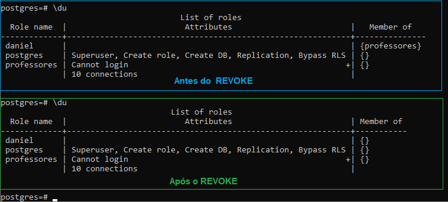

