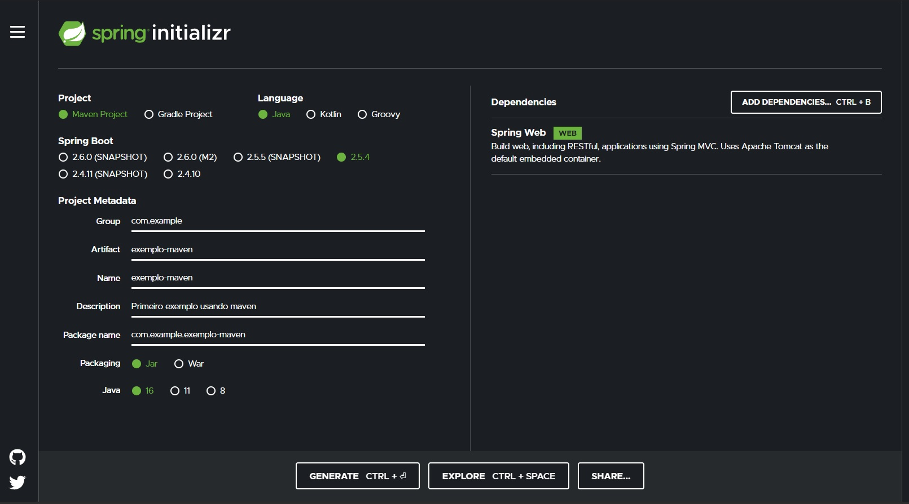

# Preparando o ambiente para programar em Java

## Instalação e ambiente

### Java JDK

````bash
sudo add-apt-repository ppa:linuxuprising/java
sudo apt update
sudo apt install oracle-java16-installer
java -version

export JAVA_HOME="/user/lib/jvm/java-16-oracle"
export PATH=$JAVA_HOME/bin:$PATH
````

### Ferramentas de build

#### Gradle

- Ganhando popularidade (Android Studio)
- Usa linguagem de programação Groovy

````bash
mkdir /opt/gradle
unzip -d /opt/gradle gradle-7.2-bin.zip
ls /opt/gradle/gradle-7.2
export PATH=$PATH:/opt/gradle/gradle-7.2/bin
gradle -v
````

#### Maven

- Legados do ANT
- Baseado em XML

````bash	
mkdir /opt/maven
unzip -d /opt/maven apache-maven-3.8.2-bin.zip
export PATH=$PATH:/opt/maven/apache-maven-3.8.2/bin
mvn -v
````

#### Wrappers

````bash
# No diretório do projeto

gradle wrapper
./gradlew -v

mvn -N io.takari:maven:wrapper
./mvnw -v

# Garante a mesma versão para todos os desenvolvedores
````

### IntelliJ

````bash
sudo tar -xzf ideaIC-2021.2.1.tar.gz
cd idea-IC-212.5080.55/bin/
cd bin
./idea.sh
````

## Criação de projetos

### Spring boot

https://start.spring.io



