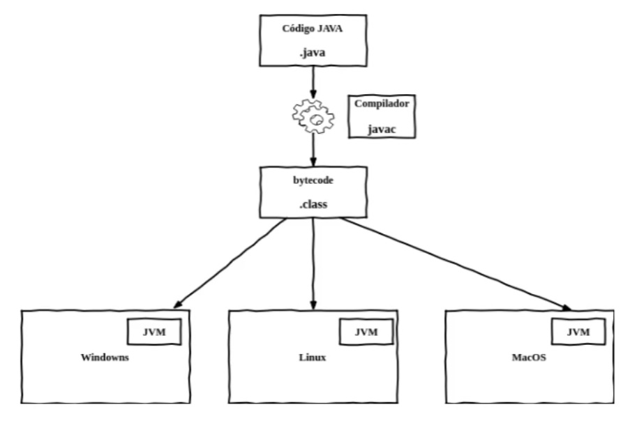

# O que precisamos saber sobre Java

## O que é Java?

Java é uma linguagem de programação e plataforma computacional lançada em 1995 pela **Sun Microsystems**, por um time comandado por **James Gosling**. Anos depois foi adquirida pela **Oracle**.

Diferente de outras linguagens de programação, que são **compiladas** para **código nativo**, o Java é compilado para um **bytecode** que é interpretado por uma **máquina virtual**.

## O que é o compilador

Um **compilador** é um **programa** que, a partir de um **código fonte**, cria um programa semanticamente equivalente, porém escrito em outra linguagem, **código objeto**. Um compilador traduz um programa de uma linguagem textual para uma linguagem de máquina, específica para um processador e sistema operacional.

O nome **compilador** é usado principalmente para os programas que **traduzem** o **código fonte** de uma **linguagem de programação de alto nível** para uma **linguagem de programação de baixo nível** (por exemplo, Assembly ou código de máquina).

## O que é o bytecode?

É o **código originado** da compilação de programas **Java**.

O **bytecode** é o programa interpretado e excutado pela **Máquina Virtual Java (JVM)**.

## O que é a JVM?

### VM - Virtual Machine
Uma **Máquina Virtual**, ou *Virtual Machine*, é um software que simula uma máquina física e consegue executar vários programas, gerenciar processos, memória e arquivos. Tudo isso faz parte de uma plataforma com memória, processador e outros recursos totalmente virtuais, sem dependência do hardware.

### JVM - Java Virtual Machine

A **JVM** é uma máquina virtual que executa programas **Java**, executando os **bytecodes** em linguagem de máquina para cada sistema operacional. 

Em linguagens compiladas diretamente para um sistema operacional (**SO**) específico, esse programa não irá executar em outro SO, havendo a necessidade de compilar uma versão do software para cada SO. 

Com o Java, compilamos para a JVM, o bytecode será executado pela máquina virtual, e não diretamente pelo SO, assim, o software escrito em Java possui portabilidade para qualquer sistema operacional, porém, cada JVM deve ser construída para um SO específico.



## O que é JRE?

**JRE** significa **Java Runtime Enviroment**, ou Ambiente de Execução do Java, é composto pela Java Virtual Machine (**JVM**), bibliotecas e APIs da linguagem Java e outros componentes para suporte da plataforma Java.

Ele apresenta a parte responsável pela execução do software Java.

`````bash
sudo apt-get install openjdk-8-jre
`````

## O que é a JDK?

**JAva Development Kit (JDK), Kit de Desenvolvimento Java**, é um conjunto de utilitários que permitem criar software para a **plataforma Java**. É composto pelo **compilador Java, bibliotecas** da linguagem, ferramentas e a **JRE**.

````bash
sudo apt-get install openjdk-8-jdk
````

## O que é Java SE?

**Java Standard Edition (SE)**, é a distribuição mínima da plataforma de desenvolvimento de aplicações Java. 

OpenJDK é a implementação de referência opensource da Plataforma Java, Java SE, que ainda é mantida pela Oracle.

## O que é Java EE?

Java **Enterprise Edition**, é uma extensão da Java SE que possui suporte a desenvolvimento de sistemas corporativos.

Além do mínimo da plataforma, o Java EE possui diversas especificações de partes da infra estrutura de aplicações, como acesso a banco de dados, mensageria, serviços web, parser de arquivos e outras. 

Servidores de Aplicações Java EE, sabem seguir essas especificações e implementar os recursos para os usuários. 

Ex.: JBoss (RedHat), Weblogic (Oracle), WebSphere (IBM) e Glassfish = Implementação de Referência Opensource : https://javaee.github.io/glassfish

## O que é Jakarta EE?

Com a falta de investimento da Oracle no Java, ela cedeu todo o código, implementações e especificações do **Java EE** para a **Eclipse Foundation**, mas como o nome Java EE é uma marca registrada, foi escolhido o nome **Jakarta EE**. 

Agora a evolução da especificações e padrões do Java será feito sob o nome Jakarta EE, com compatibilidade com o Java EE.

## Prática

````bash
mkdir hello-java
cd hello-java
vim Hello.Java
````

````java
public class hello
    public static void main(String[] args) {
    System.out.println("hello!");
}
````

````bash
:wq
java -version
javac Hello.java # compila o código
java Hello # Executa o código
cat Hello.java # Retorna o conteúdo em código java
cat Hello.class # Retorna o conteúdo em código máquina
````
