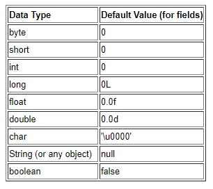

# Características da linguagem

## Iniciando um projeto Java

### Criar um novo projeto

1. Create New Project
2. Gradle
   Selecionar SDK
   Libs e Frameworks - Java
   Next
3. GroupId: \<dominio = br.com.example> 
   ArtifactId: \<Nome do projeto = Meu projeto> 
   Next
4. Habilita "Use auto-import"
   Habilita "Use default gradle wrapper"
   Seleciona a versão do JDK
   Next
5. Especifica o nome e o local do projeto
   Finish
6. File > Project Structure
   Verificar JDK
   Selecionar o level do SDK
7. Em Build Gradle
   Mudar o sourceCompatibility de acordo com a versão do Java

### Classes

Uma **classe** é um elemento do código Java que utilizamos para representar objetos do mundo real. Dentro dela é comum declararmos atributos e métodos, que representam, respectivamente, as características e comportamentos desse objeto. 

````java
package com.example.classes;

public class Programa{
    public static void main(Sti]ring[] args) {
        System.out.println("Hello world!");
    }
}
````

Composição:

- Main
- Atributos
- Métodos
  - Retornos
  - Parâmetros
  - Assinatura
- Construtores

## Tipos primitivos, wrappers, não primitivos e tipagem forte e estática

#### Primitivos

https://docs.oracle.com/javase/tutorial/java/nutsandbolts/datatypes.html

- Não aceitam NULL
- Possuem valores default



````java
//Inteiros

//Byte nullByte = null;

byte b;			//8 bits
byte b1 = 127;
byte b2 = -128;
//byte b3 = 129; //to large

char c;			//16 bits
char c1 = 'A';
char c2 = 15;
//char c3 = 'AA'; //NOK
//char c4 = -100; //NOK

short s;		//16 bits
short s1 = 32767;
short s2 = -32768;

int i = 2147483647;   //32 bits
int i2 = -2147483648;
//int i3 = -2147483649;  //to large

long l = 9223372036854775807L;	//64 bits
long l2 = -9223372036854775808L;
//long l3 = 9223372036854775808L;  //to large

//FLUTUANTES

float f = 65f;		//32 bits	3.402,823,5 E+38
float f2 = 65.0f;
float f3 = -0.5f;	//1.4 E-45

double d = 1024.99;		//64 bits	1.797,693,134,862,315,7E+308
double d2 = 10.2456;	//4.9E-324

//BOLEANO

boolean bo = true;
boolean bo2 = false;
//boolean bo3 = "false";	//NOK
//boolean bo4 = 'true';		//NOK

//void v; //palavra reservada

//System.out.println("byte : " + b); //ERROR
````

````JAVA
//EM "DefaultValues.Java"

public class DefaultValues {
    public static void main(String[] args){
        final Default d = new Default();
        System.out.println(d.getI());
        System.out.println(d.isActive());
    }
}

class Default {
    int i;
    boolean active;
    public int getI() {return i;}
    public int isActive() {return active;}
}
````

#### Wrappers

- São objetos que representam os primitivos
- Auto-boxing e Unboxing

````java
//Autoboxing

Byte b = 127;	//Byte
Byte b2 = -128;
Byte nullByte = null;

Character c = 'A';	//char
Character c2 = 15;
	
Short s = 32767;	//short
Short s2 = -32768;

Integer i = 2147483647;   //int
Integer i2 = -2147483648;

Long l = 9223372036854775807L;	//long
Long l2 = -9223372036854775808L;

Float f = 65f;		//float
Float f2 = 65.0f;
Float f3 = -0.5f;

Double d = 1024.99;		//double
Double d2 = 10.2456;

Boolean bo = true;	//boolean
Boolean bo2 = false;

boolean bo3 = Boolean.getBoolean(s:"false"); //OK
boolean bo4 = Boolean.valueOf("true");		//OK

//Unboxing

int i = new Integer(i:3);  //Depreciada

int inteiro = Integer.valueOf(1024);

//boolean b = new Boolean(true);
boolean b2 = Boolean.TRUE;
boolean b3 = Boolean.getBoolean(s:"false");
````

#### Não primitivos

````java
//String
String texto = "Meu texto para apresentação";  //Sequência de caracteres

//Number
Number numero = Integer.valueOf(100);
numero.toString();

//Object
Object o = new Object();

//Qualquer outros objetos
Void v; //Tipo válido
````

#### Tipagem forte e estática

**Forte**

````java
String texto = "meu texto";
//texto = 1000;	//NOK

Integer numero = 1024;
numero = 512;	//OK
````

**Estática**
Faz a verificação dos tipos em tempo de compilação

````java
Integer numero = "123456789";	//error
````

**var - Inferência de tipo** 

````java
var numero = Integer.valueOf("123456");
var texto = "O numero é : ";
System.out.println(texto + numero);
````

## Modificadores de acesso

**public:** pode ser acessada de qualquer lugar por qualquer entidade que possa visualizar a classe a que ela pertence. 

**private:** os métodos e atributos da classe definidos como privados não podem ser acessados ou usados por nenhuma outra classe. Esses atributos e métodos também não podem ser visualizados pelas classes herdadas.

**protected:** Torna o membro acessível às classes do mesmo pacote ou através de herança, seus membros herdados não são acessíveis a outras classes fora do pacote em que foram declarados. 

**default (padrão):** A classe e/ou seus membros são acessíveis somente por classes do mesmo pacote, na sua declaração não é definido nenhum tipo de modificador, sendo este identificado pelo compilador.

**Prática**

````Java
package com.example.classes.usuario;
public class ProgramaDoSuperUsuario {
    final var superUsuario = new SuperUsuario(login: "root", senha:"1234");
    superUsuario.getLogin();
    superUsuario.getSenha();
    String root = superUsuario.nome;
}
````

````Java
package com.example.classes.usuario;
public class SuperUsuario {
    private String login;
    private String senha;
    String nome;
    
    public SuperUsuario(final String login, final String senha) {
        this.login = login;
        this.senha = senha;
    }
    
    public String getLogin() {
        return login;
    }
    
    protected String getSenha() {
        return senha;
    }
}
````

**abstract:** Esse modificador não é aplicado nas variáveis, apenas em classes e métodos. Uma classe abstrata não pode ser instanciada. Se houver alguma declaração de um método como abstract (abstrato), a classe também deve ser marcada como abstract.

````java
//Apenas uma ideia, não pode ser instaciada
public abstract class FormaGeometrica {
    public abstract String nome();
    public abstract Double area();
    
    public String desenha(int x, int y) {
        return "desenhando as coordenadas X=$x Y:$y"; 
    }
}

public class Quadrado extends FormaGeometrica { 
    private String nome; 
    private Double area; 
    public Quadrado(final String nome, final Double area){
        this.nome = nome; 
        this.area = area; 
    }
    @Override 
    public String nome() { 
        return nome;
    } 
    @Override 
    public Double area() { return area;}
    @Override 
    public String toString() {
        final StringBuilder builder = "Quadrado [";
        return builder;
    }
}
````

**static:** E usado para a criação de uma variável que poderá ser acessada por todas as instâncias de objetos desta classe como uma variável comum, ou seja, a variável criada será a mesma em todas as instancias e quando seu conteúdo é modificado numa das instâncias, a modificação ocorre em todas as demais. E nas declarações de métodos ajudam no acesso direto à classe, portanto não é necessários instanciar um objeto para acessar o método.

**final:** Quando é aplicado na classe, não permite estender, nos métodos impede que o mesmo seja sobrescrito (overriding) na subclasse, e nos valores de variáveis não pode ser alterado depois que já tenha sido atribuído um valor.

## Métodos abstratos, default e herança múltipla


